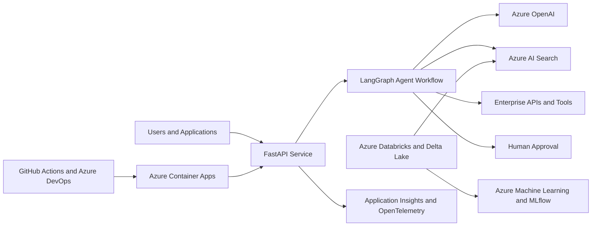

# Azure Enterprise AI Platform

A production-oriented enterprise AI platform being developed for Microsoft Azure.

This project demonstrates how data engineering, retrieval-augmented generation (RAG), agent workflows, traditional machine learning, testing, monitoring, security, and automated deployment can work together as one reusable platform.

> **Status:** Active development. The local API, configuration, testing, and Docker foundation are complete. Azure and AI components are being added incrementally.

## Business Scenarios

The platform is designed to support two enterprise scenarios using synthetic, non-confidential data.

### Benefits Operations

- Answer benefit-policy questions using approved documents.
- Return supporting sources and citations.
- Retrieve synthetic claim information through secure APIs.
- Escalate uncertain or sensitive requests for human review.

### Manufacturing Operations

- Answer questions using equipment manuals and safety procedures.
- Retrieve maintenance and inventory information.
- Detect operational risks using machine-learning models.
- Create maintenance work orders only after human approval.

## Current Implementation

The completed foundation includes:

- Python 3.12 project with `pyproject.toml` packaging
- FastAPI application with automatically generated API documentation
- Typed `/health` endpoint for application and container monitoring
- Environment-based configuration using Pydantic Settings
- Automated testing using pytest
- Static type checking using mypy
- Linting and formatting using Ruff
- Docker packaging for reproducible execution
- Automated Docker health checks
- Non-root container execution for improved security
- Clean, incremental Git commit history

## Target Architecture

The following architecture will be implemented incrementally:



## Planned Azure and AI Components

- Azure OpenAI and Microsoft Foundry
- Azure AI Search
- Azure Blob Storage
- Azure Functions
- Azure Container Apps
- Azure Databricks and Delta Lake
- Azure Machine Learning and MLflow
- LangChain and LangGraph
- Microsoft Entra ID and managed identities
- Azure Key Vault
- Application Insights and OpenTelemetry
- Bicep infrastructure as code
- GitHub Actions and Azure DevOps pipelines

## Run Locally

### 1. Clone the repository

```bash
git clone https://github.com/Razavisr/azure-enterprise-ai-platform.git
cd azure-enterprise-ai-platform
```

### 2. Create a Python environment

```bash
python3.12 -m venv .venv
source .venv/bin/activate
```

The virtual environment keeps this project's Python packages separate from packages used by other projects.

### 3. Install the project

```bash
python -m pip install --editable ".[dev]"
```

`--editable` connects the installed package to the source code, so local code changes are available without reinstalling the project.

`.[dev]` installs both the application dependencies and development tools such as pytest, Ruff, and mypy.

### 4. Configure the environment

```bash
cp .env.example .env
```

The application uses safe local defaults. Environment variables can override those defaults without changing the source code.

### 5. Start the API

```bash
python -m uvicorn enterprise_ai_platform.main:app --reload
```

Open:

- API documentation: http://127.0.0.1:8000/docs
- Health endpoint: http://127.0.0.1:8000/health

## Run the Quality Checks

```bash
ruff check .
ruff format --check .
mypy src tests
pytest -v
```

These commands check code quality, formatting, type correctness, and application behaviour.

## Run with Docker

### Build the image

```bash
docker build --tag azure-enterprise-ai-platform:0.1.0 .
```

### Start the container

```bash
docker run \
  --name azure-enterprise-ai-platform-local \
  --publish 8000:8000 \
  --rm \
  azure-enterprise-ai-platform:0.1.0
```

The container runs the FastAPI service as a non-root user and checks the `/health` endpoint every 30 seconds.

After starting the container, open:

- http://127.0.0.1:8000/health
- http://127.0.0.1:8000/docs

## Repository Structure

```text
azure-enterprise-ai-platform/
├── src/
│   └── enterprise_ai_platform/
│       ├── __init__.py
│       ├── config.py
│       └── main.py
├── tests/
│   ├── test_config.py
│   └── test_health.py
├── .dockerignore
├── .env.example
├── .gitignore
├── Dockerfile
├── pyproject.toml
└── README.md
```

## Development Roadmap

| Phase | Deliverable | Status |
|---|---|---|
| 1 | FastAPI, configuration, tests, and Docker foundation | Complete |
| 2 | Azure account, resource organization, identity, and deployment foundation | In progress |
| 3 | Databricks, Delta Lake, document processing, and data quality | Planned |
| 4 | Azure AI Search and citation-supported RAG | Planned |
| 5 | LangChain and LangGraph agent workflows with human approval | Planned |
| 6 | Azure Machine Learning, MLflow, evaluation, and monitoring | Planned |
| 7 | Infrastructure as code and CI/CD using GitHub Actions and Azure DevOps | Planned |
| 8 | Security hardening, documentation, and final demonstration | Planned |

## Security and Cost Principles

- Use synthetic data instead of confidential business or personal data.
- Never commit credentials, API keys, or `.env` files.
- Prefer managed identities instead of stored credentials in Azure.
- Use Azure Key Vault for secrets required by deployed services.
- Apply least-privilege access controls.
- Add budgets and resource tags before provisioning Azure services.
- Remove temporary cloud resources after demonstrations to prevent unnecessary costs.

## Project Goals

By completion, this repository will demonstrate:

- Production-oriented Python API development
- Azure-based generative AI and RAG
- Controlled agent workflows
- Databricks data engineering
- Traditional machine-learning lifecycle management
- Automated evaluation and observability
- Containerized cloud deployment
- Infrastructure as code
- CI/CD and MLOps practices
- Enterprise security and governance considerations