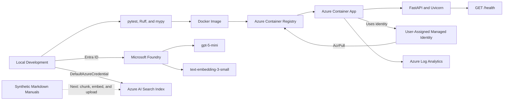
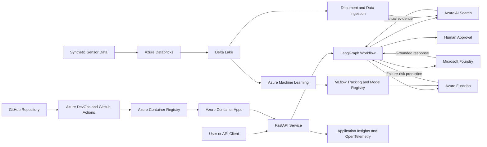

# Azure Enterprise AI Platform

A hands-on portfolio project demonstrating how to build, deploy, and operate an enterprise AI application on Microsoft Azure.

The project uses a fictional predictive-maintenance scenario and synthetic equipment data. Its purpose is to demonstrate cloud architecture, retrieval-augmented generation (RAG), agent orchestration, machine learning, data engineering, security, testing, observability, and MLOps without using confidential data.

> **Status:** Active development. The API, Docker, Azure deployment, Microsoft Foundry model deployments, and Azure AI Search index foundation are complete. Document ingestion, embeddings, hybrid retrieval, and RAG answer generation are the next milestone.

## Demo Scenario

The finished application will act as a predictive-maintenance assistant for fictional industrial equipment.

A user will be able to provide:

- An equipment model, such as `PX-200`
- A maintenance question
- Current sensor readings, such as temperature, vibration, pressure, flow rate, and motor current

The platform will then:

1. Retrieve relevant instructions from the correct equipment manual using Azure AI Search.
2. Send sensor readings to a machine-learning risk model through Azure Functions.
3. Use a LangGraph workflow to coordinate retrieval, prediction, and decision logic.
4. Use a model deployed through Microsoft Foundry to combine the evidence into a grounded response.
5. Include supporting manual sections and the predicted failure risk.
6. Require human approval before recommending consequential actions such as shutdowns or work orders.

All manuals, sensor data, thresholds, and equipment models in this repository are synthetic and must not be used to operate real equipment.

## Implementation Status

| Area | Status | Current result |
|---|---|---|
| Python application foundation | Complete | Packaged Python 3.12 FastAPI application |
| Configuration | Complete | Typed settings loaded from defaults, `.env`, or environment variables |
| Automated quality checks | Complete | pytest, Ruff, and strict mypy checks |
| Containerization | Complete | Non-root Docker image with health monitoring |
| Azure deployment foundation | Complete | Application deployed to Azure Container Apps |
| Azure security foundation | Complete | Managed identity and role-based access control |
| Microsoft Foundry resources | Complete | Foundry project and two model deployments created and tested |
| Azure AI Search foundation | Complete | Live eight-field keyword/vector index created |
| Synthetic manuals | Complete | PX-200 and AX-100 manuals added |
| Document ingestion | Next | Chunking, embedding generation, and upload |
| Hybrid retrieval | Planned | Keyword and vector search with metadata filtering |
| RAG answer generation | Planned | Grounded answers with source information |
| LangGraph workflow | Planned | Controlled orchestration across AI Search, ML, and tools |
| Databricks and Delta Lake | Planned | Synthetic sensor-data engineering pipeline |
| Azure Machine Learning and MLflow | Planned | Failure-risk model training, tracking, and registration |
| Azure Functions | Planned | Serverless access to the registered ML model |
| Evaluation and observability | Planned | RAG, model, workflow, and operational monitoring |
| CI/CD and infrastructure as code | Planned | Azure DevOps, GitHub Actions, and Bicep |

## What Works Today

### Application foundation

- Python 3.12 package managed through `pyproject.toml`
- FastAPI application served by Uvicorn
- Generated OpenAPI specification and Swagger documentation
- Typed `GET /health` endpoint
- Environment-based configuration using Pydantic Settings
- Configuration through `AI_PLATFORM_*` environment variables
- Automated tests using pytest
- Static type checking using strict mypy
- Linting and formatting using Ruff

The current health endpoint confirms that the API process is running. It does not yet test connections to Azure AI Search, Microsoft Foundry, or future downstream services.

### Docker foundation

- Containerized Python application
- Non-root Linux user with UID `10001`
- Port `8000` exposed for the API
- Docker health check calling `/health`
- Small Python 3.12 slim base image
- Unnecessary local files excluded through `.dockerignore`

### Azure hosting foundation

The current development environment was provisioned and verified manually through Azure CLI and Azure Portal.

It includes:

- Private Azure Container Registry
- Azure Container Apps Consumption environment
- Public HTTPS ingress for the development API
- Scale-to-zero configuration
- Maximum of one development replica
- User-assigned managed identity
- Least-privilege `AcrPull` role assignment
- Centralized logging through Azure Log Analytics
- Azure budget monitoring and resource tagging

Infrastructure as code and automated deployment pipelines have not been added yet.

### Microsoft Foundry foundation

The Azure development environment includes:

- A Microsoft Foundry resource
- A Foundry project
- A `gpt-5-mini` chat-model deployment
- A `text-embedding-3-small` embedding deployment
- Successful chat and embedding tests through Azure
- Microsoft Entra ID access for development

The embedding deployment returns vectors with 1,536 dimensions.

The application does not call these model deployments yet. Application integration begins during document ingestion and RAG implementation.

### Azure AI Search foundation

The repository contains:

- An eight-field search-index schema
- Searchable text fields for keyword retrieval
- A 1,536-dimensional vector field
- HNSW approximate-nearest-neighbour configuration
- Cosine vector similarity
- Metadata fields for equipment-specific filtering
- A Python utility that creates or updates the Azure AI Search index
- Passwordless authentication through `DefaultAzureCredential`
- Automated tests for the index structure

The live `equipment-manuals` index has been created successfully in Azure AI Search.

The index is currently empty. Document chunking, embedding generation, upload, and querying are the next implementation steps.

## Current Architecture

The following components are currently implemented or manually provisioned:



The Container App currently runs the health-enabled FastAPI foundation. It is not yet connected to Foundry or Azure AI Search.

## Target Architecture



## Planned End-to-End Request

An example finished request might contain:

```json
{
  "equipment_model": "PX-200",
  "question": "Should this pump continue operating?",
  "sensor_readings": {
    "temperature_c": 96,
    "vibration_mm_s": 7.8,
    "pressure_bar": 3.2,
    "flow_rate_l_min": 112,
    "motor_current_a": 17.5,
    "hours_since_maintenance": 2100
  }
}
```

The planned LangGraph workflow will:

```text
Validate the request
    → retrieve PX-200 manual sections
    → request a failure-risk prediction
    → compare the retrieved instructions with the prediction
    → generate a grounded response
    → add sources and risk information
    → request human review when necessary
```

The large language model will explain the evidence. It will not replace the predictive model, invent operating thresholds, or automatically authorize physical actions.

## Azure AI Search Index

The `equipment-manuals` index currently contains this schema:

| Field | Purpose |
|---|---|
| `id` | Unique identifier for each future document chunk |
| `equipment_model` | Equipment identifier used for filtering and faceting |
| `document_title` | Name of the source manual |
| `section_title` | Heading of the manual section |
| `content` | Searchable section text |
| `source` | Original source path or document reference |
| `chunk_order` | Position of the chunk within the document |
| `content_vector` | Hidden 1,536-dimensional embedding used for vector search |

The design supports three complementary retrieval methods:

- Keyword search for exact technical words, model numbers, and measurements
- Vector search for semantically similar questions and instructions
- Metadata filtering to prevent instructions for one equipment model from being mixed with another

The retrieval implementation will combine keyword and vector results into hybrid search.

## Synthetic Manuals

Two fictional manuals are currently included:

### PX-200

A fictional centrifugal process pump with guidance covering:

- Normal operating ranges
- Abnormal vibration
- High temperature
- Low pressure and flow
- High motor current
- Maintenance prioritization
- Human approval and lockout/tagout considerations

### AX-100

A fictional auxiliary pump with intentionally different thresholds.

The second manual helps test whether retrieval correctly filters by equipment model instead of returning similar but incorrect instructions from another machine.

## Azure Resources

| Resource | Name | Purpose |
|---|---|---|
| Resource group | `rg-enterprise-ai-platform-dev` | Organizes development resources, access, tags, and costs |
| Container registry | `razavisraiplatform` | Stores private application images |
| Managed identity | `id-enterprise-ai-platform-dev` | Allows passwordless container-image retrieval |
| Log Analytics workspace | `log-enterprise-ai-platform-dev` | Stores application and Azure system logs |
| Container Apps environment | `cae-enterprise-ai-platform-dev` | Provides the Container Apps compute, networking, and logging boundary |
| Container App | `ca-enterprise-ai-api-dev` | Runs the FastAPI container and exposes HTTPS ingress |
| Foundry resource | `aif-razavisr-platform-dev` | Hosts AI model deployments |
| Foundry project | `enterprise-ai-platform-dev` | Organizes development work in Microsoft Foundry |
| Chat deployment | `gpt-5-mini` | Generates the future grounded assistant response |
| Embedding deployment | `text-embedding-3-small` | Converts queries and manual chunks into vectors |
| AI Search service | `srch-razavisr-platform-dev` | Hosts searchable enterprise knowledge indexes |
| AI Search index | `equipment-manuals` | Stores future manual chunks, metadata, and embeddings |

These resources currently represent a manually provisioned development environment. Bicep will later make the infrastructure reproducible.

## Repository Structure

```text
azure-enterprise-ai-platform/
├── data/
│   └── manuals/
│       ├── ax-100/
│       │   └── operation-and-maintenance.md
│       └── px-200/
│           └── operation-and-maintenance.md
├── src/
│   └── enterprise_ai_platform/
│       ├── rag/
│       │   ├── __init__.py
│       │   ├── create_index.py
│       │   └── index_schema.py
│       ├── __init__.py
│       ├── config.py
│       └── main.py
├── tests/
│   ├── test_config.py
│   ├── test_health.py
│   └── test_index_schema.py
├── .dockerignore
├── .env.example
├── .gitignore
├── Dockerfile
├── pyproject.toml
└── README.md
```

## Prerequisites

The base application requires:

- Git
- Python 3.12

Docker testing additionally requires:

- Docker Desktop

Azure operations additionally require:

- An Azure subscription
- Azure CLI
- Access to the Azure resources
- Appropriate Azure role assignments

## Run Locally

### 1. Clone the repository

```bash
git clone https://github.com/Razavisr/azure-enterprise-ai-platform.git
cd azure-enterprise-ai-platform
```

### 2. Create a virtual environment

```bash
python3.12 -m venv .venv
```

Activate it on macOS or Linux:

```bash
source .venv/bin/activate
```

The virtual environment keeps this project’s Python interpreter and dependencies separate from other projects.

### 3. Install the project

```bash
python -m pip install --editable ".[dev]"
```

`--editable` connects the installed package to the source directory, so source-code changes are immediately available.

`.[dev]` installs the application dependencies and development tools.

### 4. Create local configuration

```bash
cp .env.example .env
```

The example configuration contains:

```dotenv
AI_PLATFORM_APP_NAME="Azure Enterprise AI Platform"
AI_PLATFORM_SERVICE_NAME="azure-enterprise-ai-platform"
AI_PLATFORM_APP_VERSION="0.1.0"
AI_PLATFORM_ENVIRONMENT="local"
AI_PLATFORM_LOG_LEVEL="INFO"

AI_PLATFORM_AZURE_OPENAI_ENDPOINT="https://your-foundry-resource.openai.azure.com"
AI_PLATFORM_AZURE_OPENAI_CHAT_DEPLOYMENT="gpt-5-mini"
AI_PLATFORM_AZURE_OPENAI_EMBEDDING_DEPLOYMENT="text-embedding-3-small"

AI_PLATFORM_AZURE_SEARCH_ENDPOINT="https://your-search-service.search.windows.net"
AI_PLATFORM_AZURE_SEARCH_INDEX_NAME="equipment-manuals"
```

Replace the placeholder endpoints in the private `.env` file with the endpoints for your Azure resources.

The `.env` file is excluded from Git. Never commit credentials, API keys, access tokens, or private configuration.

### 5. Start the API

```bash
python -m uvicorn enterprise_ai_platform.main:app --reload
```

Open:

- API documentation: http://127.0.0.1:8000/docs
- Health endpoint: http://127.0.0.1:8000/health

Expected health response:

```json
{
  "status": "healthy",
  "service": "azure-enterprise-ai-platform",
  "version": "0.1.0"
}
```

## Run Quality Checks

Run linting:

```bash
ruff check .
```

Check formatting:

```bash
ruff format --check .
```

Run strict static type checking:

```bash
mypy src tests
```

Run the automated test suite:

```bash
pytest -v
```

At this project checkpoint, all six tests pass.

To include test coverage:

```bash
pytest --cov=enterprise_ai_platform --cov-report=term-missing
```

The tests currently cover:

- Safe configuration defaults
- Environment-variable overrides
- Invalid environment rejection
- Azure service configuration
- Health-endpoint behaviour
- Azure AI Search index structure

The Azure index-creation utility is currently verified manually against Azure rather than through an automated integration test.

## Create or Update the Azure AI Search Index

Sign in through Azure CLI:

```bash
az login
```

Confirm the active subscription:

```bash
az account show --output table
```

`DefaultAzureCredential` can use the Azure CLI login for local development. This allows the Python utility to access Azure without storing an Azure AI Search administrator key.

Create or update the index:

```bash
python -m enterprise_ai_platform.rag.create_index
```

Expected output:

```text
Azure AI Search index 'equipment-manuals' is ready with 8 fields.
```

Running this command again updates the index definition rather than creating a duplicate index.

The signed-in user requires permission to manage the search index. The development environment uses Azure role-based access control for this access.

## Run with Docker

### Build the image

```bash
docker build \
  --tag azure-enterprise-ai-platform:0.1.0 \
  .
```

### Start the container

```bash
docker run \
  --name azure-enterprise-ai-platform-local \
  --publish 8000:8000 \
  --rm \
  azure-enterprise-ai-platform:0.1.0
```

Verify the container:

```bash
curl http://127.0.0.1:8000/health
```

Inspect its status:

```bash
docker ps
```

View its logs:

```bash
docker logs azure-enterprise-ai-platform-local
```

The Docker health check calls `/health` every 30 seconds while the container is running.

The container runs as a non-root user. Because `--rm` is used, Docker removes the container after it is stopped. The image remains available for future containers.

## Verify the Azure Deployment

Sign in and confirm the active subscription:

```bash
az login
az account show --output table
```

Retrieve the Container App hostname:

```bash
CONTAINER_APP_FQDN=$(az containerapp show \
  --name ca-enterprise-ai-api-dev \
  --resource-group rg-enterprise-ai-platform-dev \
  --query properties.configuration.ingress.fqdn \
  --output tsv)
```

Call the deployed health endpoint:

```bash
curl "https://${CONTAINER_APP_FQDN}/health"
```

Open the deployed Swagger documentation using:

```text
https://<container-app-hostname>/docs
```

## View Azure Logs

View recent application console logs:

```bash
az containerapp logs show \
  --name ca-enterprise-ai-api-dev \
  --resource-group rg-enterprise-ai-platform-dev \
  --type console \
  --tail 30 \
  --format text
```

View Azure system logs:

```bash
az containerapp logs show \
  --name ca-enterprise-ai-api-dev \
  --resource-group rg-enterprise-ai-platform-dev \
  --type system \
  --tail 30 \
  --format text
```

Historical application logs can be queried in the Log Analytics workspace:

```kusto
ContainerAppConsoleLogs_CL
| where ContainerAppName_s == "ca-enterprise-ai-api-dev"
| order by TimeGenerated desc
| take 50
```

Historical Azure system logs can be queried with:

```kusto
ContainerAppSystemLogs_CL
| where ContainerAppName_s == "ca-enterprise-ai-api-dev"
| order by TimeGenerated desc
| take 50
```

## Security Decisions

Current security measures include:

- Synthetic data instead of confidential operational or customer data
- Private Azure Container Registry
- Disabled registry administrator credentials
- User-assigned managed identity for container-image access
- Least-privilege `AcrPull` access
- Microsoft Entra ID authentication for local Azure AI Search access
- Non-root Docker execution
- Environment-based configuration
- `.env`, credentials, tokens, keys, and local Azure state excluded from Git

Planned security improvements include:

- Managed identity access from the application to Foundry and Azure AI Search
- Azure Key Vault for any required secrets
- API authentication and authorization
- Private endpoints for production Azure services
- Network restrictions
- Automated dependency and container scanning
- Human approval before consequential agent actions

## Cost Controls

The development environment uses:

- Azure resource tags
- Azure budget notifications
- Azure Container Apps Consumption workload profile
- Zero minimum Container App replicas
- Maximum of one development replica
- Free Azure AI Search tier
- Log Analytics daily ingestion limits
- Token-based Foundry model usage

Future controls will include:

- Automatic Databricks cluster termination
- Small development compute sizes
- Azure Machine Learning compute scale-down
- No continuously running Azure ML endpoint
- Removal of temporary deployment resources after demonstrations

Azure Container Registry remains provisioned and may continue to have a small storage/service cost while it exists.

## Current Limitations

At the current checkpoint:

- The FastAPI application exposes only `/health`.
- The health endpoint checks process liveness, not downstream Azure services.
- The Azure AI Search index exists but contains no documents yet.
- Document chunking and embedding generation are not implemented yet.
- The application does not query Azure AI Search yet.
- The application does not call the Foundry model deployments yet.
- RAG responses and citations are not implemented yet.
- LangGraph, Azure Functions, Databricks, Delta Lake, Azure ML, and MLflow are planned.
- Azure infrastructure was provisioned manually and is not yet represented as Bicep.
- CI/CD workflows have not been added.
- API authentication has not been added.
- The automated tests are unit tests, not Azure integration tests.

These boundaries are documented intentionally so that each future milestone can be demonstrated and verified separately.

## Development Roadmap

| Phase | Deliverable | Status |
|---|---|---|
| 1 | FastAPI, typed configuration, automated tests, and Docker foundation | Complete |
| 2 | Azure Container Registry, managed identity, Container Apps, and Log Analytics | Complete |
| 3 | Microsoft Foundry project, model deployments, Azure AI Search service, and index schema | Complete |
| 4 | Manual chunking, embedding generation, document upload, and hybrid retrieval | Next |
| 5 | RAG API and LangGraph workflow with evidence and human-review routing | Planned |
| 6 | Databricks and Delta Lake synthetic sensor-data pipeline | Planned |
| 7 | Azure Machine Learning model training, MLflow tracking, and model registration | Planned |
| 8 | Azure Function for failure-risk prediction | Planned |
| 9 | Integrated AI Search, ML prediction, and Foundry response generation | Planned |
| 10 | Evaluation, observability, Bicep, Azure DevOps, and GitHub Actions | Planned |

## Engineering Goals

By completion, this project will demonstrate:

- Production-minded Python API development
- Secure containerized deployment on Azure
- Passwordless Azure authentication
- Enterprise search and retrieval-augmented generation
- Equipment-specific metadata filtering
- Controlled LangGraph agent workflows
- Traditional machine-learning lifecycle management
- Databricks and Delta Lake data engineering
- Serverless model access through Azure Functions
- Human review for consequential decisions
- Automated testing and evaluation
- Cloud logging and observability
- Infrastructure as code
- CI/CD and MLOps practices
- Security, governance, and cost awareness