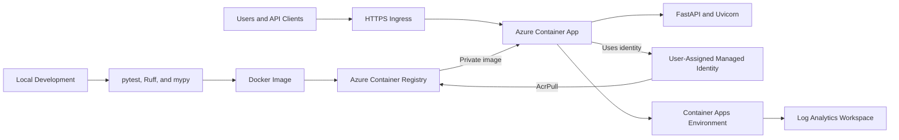
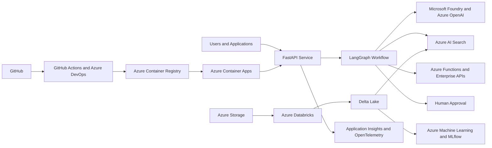

# Azure Enterprise AI Platform

A production-oriented platform for building, deploying, and operating enterprise AI applications on Microsoft Azure.

The project currently provides a tested, containerized FastAPI service running in Azure Container Apps. It uses a private Azure Container Registry, managed identity authentication, automatic scaling, centralized logging, and cost controls.

The next stages will add enterprise data engineering, retrieval-augmented generation (RAG), controlled agent workflows, traditional machine learning, evaluation, infrastructure as code, and CI/CD.

> **Status:** Active development. The Python, Docker, and initial Azure deployment foundations are complete. AI and data-platform components are being added incrementally.

## What Works Today

The current implementation includes:

- Python 3.12 application packaged with `pyproject.toml`
- FastAPI service with generated OpenAPI and Swagger documentation
- Typed `/health` endpoint
- Environment-based configuration using Pydantic Settings
- Automated tests using pytest
- Static type checking using mypy
- Linting and formatting using Ruff
- Reproducible Docker packaging
- Docker health monitoring
- Secure, non-root container execution
- Private image storage in Azure Container Registry
- Azure Container Apps deployment using the Consumption workload profile
- Public HTTPS ingress connected to container port `8000`
- Scale-to-zero configuration with a maximum of one development replica
- User-assigned managed identity for passwordless image retrieval
- Least-privilege `AcrPull` access to the container registry
- Centralized console and system logs in Azure Log Analytics
- Azure resource tagging, budget monitoring, and a Log Analytics daily ingestion cap

The deployed Azure API, `/health` endpoint, Swagger documentation, Container Apps logs, and Log Analytics queries have been tested successfully.

## Current Architecture



### Deployment flow

```text
Python source code
    → automated local checks
    → Docker image
    → Azure Container Registry
    → managed-identity authentication
    → Azure Container Apps revision
    → HTTPS API
    → centralized Azure logs
```

## Azure Resources

| Resource | Name | Purpose |
|---|---|---|
| Resource group | `rg-enterprise-ai-platform-dev` | Organizes development resources, tags, access and cost tracking |
| Container registry | `razavisraiplatform` | Stores private application images |
| Managed identity | `id-enterprise-ai-platform-dev` | Authenticates the Container App without a stored registry password |
| Log Analytics workspace | `log-enterprise-ai-platform-dev` | Stores and queries application and Azure system logs |
| Container Apps environment | `cae-enterprise-ai-platform-dev` | Provides the shared networking, logging and compute boundary |
| Container App | `ca-enterprise-ai-api-dev` | Runs the FastAPI container and exposes the HTTPS API |

## Planned Business Scenarios

The platform will demonstrate two enterprise scenarios using synthetic, non-confidential data.

### Benefits operations

- Answer benefit-policy questions using approved documents.
- Provide supporting sources and citations.
- Retrieve synthetic claim information through controlled tools.
- Detect uncertain or sensitive requests.
- Require human review before consequential actions.

### Manufacturing operations

- Answer questions using equipment manuals and safety procedures.
- Retrieve synthetic maintenance and inventory information.
- Use machine-learning models to detect operational risks.
- Recommend maintenance actions.
- Require human approval before creating work orders.

## Target AI and Data Architecture



## Technology Stack

### Implemented

- Python 3.12
- FastAPI
- Pydantic and Pydantic Settings
- Uvicorn
- pytest and pytest-cov
- Ruff
- mypy
- Docker
- Azure CLI
- Azure Container Registry
- Azure Container Apps
- Microsoft Entra managed identities
- Azure role-based access control
- Azure Log Analytics

### Planned

- Microsoft Foundry and Azure OpenAI
- Azure AI Search
- Azure Blob Storage
- Azure Functions
- Azure Databricks
- Delta Lake
- Azure Machine Learning
- MLflow
- LangChain
- LangGraph
- Application Insights
- OpenTelemetry
- Azure Key Vault
- Bicep
- GitHub Actions
- Azure DevOps

## Run Locally

### 1. Clone the repository

```bash
git clone https://github.com/Razavisr/azure-enterprise-ai-platform.git
cd azure-enterprise-ai-platform
```

### 2. Create and activate a virtual environment

```bash
python3.12 -m venv .venv
source .venv/bin/activate
```

The virtual environment keeps this project’s Python interpreter and packages separate from other projects.

### 3. Install the application and development dependencies

```bash
python -m pip install --editable ".[dev]"
```

`--editable` connects the installed package to the source directory, so local code changes are immediately available.

`.[dev]` installs the application dependencies together with pytest, Ruff, mypy, and other development tools.

### 4. Create the local configuration file

```bash
cp .env.example .env
```

The application has safe local defaults. Environment variables can override those defaults without changing source code.

### 5. Start the API

```bash
python -m uvicorn enterprise_ai_platform.main:app --reload
```

Open:

- API documentation: http://127.0.0.1:8000/docs
- Health endpoint: http://127.0.0.1:8000/health

## Run the Quality Checks

```bash
ruff check .
ruff format --check .
mypy src tests
pytest -v
```

These checks validate code quality, formatting, type correctness, configuration behaviour, and API behaviour.

To include test coverage:

```bash
pytest --cov=enterprise_ai_platform --cov-report=term-missing
```

## Run with Docker

### Build the image

```bash
docker build \
  --tag azure-enterprise-ai-platform:0.1.0 \
  .
```

### Start the container

```bash
docker run \
  --name azure-enterprise-ai-platform-local \
  --publish 8000:8000 \
  --rm \
  azure-enterprise-ai-platform:0.1.0
```

The container:

- Runs the FastAPI service through Uvicorn.
- Uses a non-root Linux user.
- Exposes port `8000`.
- Checks `/health` every 30 seconds.
- Removes itself after it is stopped because of the `--rm` option.

Verify it locally:

```bash
curl http://127.0.0.1:8000/health
```

## Verify the Azure Deployment

Sign in to Azure CLI and select the correct subscription:

```bash
az login
az account show --output table
```

Retrieve the Container App hostname:

```bash
CONTAINER_APP_FQDN=$(az containerapp show \
  --name ca-enterprise-ai-api-dev \
  --resource-group rg-enterprise-ai-platform-dev \
  --query properties.configuration.ingress.fqdn \
  --output tsv)
```

Call the deployed health endpoint:

```bash
curl "https://$CONTAINER_APP_FQDN/health"
```

Print the Azure-hosted Swagger documentation address:

```bash
echo "https://$CONTAINER_APP_FQDN/docs"
```

## View Azure Logs

View recent application console logs:

```bash
az containerapp logs show \
  --name ca-enterprise-ai-api-dev \
  --resource-group rg-enterprise-ai-platform-dev \
  --type console \
  --tail 30 \
  --format text
```

View Azure system logs:

```bash
az containerapp logs show \
  --name ca-enterprise-ai-api-dev \
  --resource-group rg-enterprise-ai-platform-dev \
  --type system \
  --tail 30 \
  --format text
```

Historical logs can also be queried from the Azure Portal through:

```text
Log Analytics workspaces
→ log-enterprise-ai-platform-dev
→ Logs
```

Example application-log query:

```kusto
ContainerAppConsoleLogs_CL
| where ContainerAppName_s == "ca-enterprise-ai-api-dev"
| order by TimeGenerated desc
| take 50
```

Example Azure system-log query:

```kusto
ContainerAppSystemLogs_CL
| where ContainerAppName_s == "ca-enterprise-ai-api-dev"
| order by TimeGenerated desc
| take 50
```

## Repository Structure

```text
azure-enterprise-ai-platform/
├── src/
│   └── enterprise_ai_platform/
│       ├── __init__.py
│       ├── config.py
│       └── main.py
├── tests/
│   ├── test_config.py
│   └── test_health.py
├── .dockerignore
├── .env.example
├── .gitignore
├── Dockerfile
├── pyproject.toml
└── README.md
```

The repository structure will expand as data engineering, AI workflows, infrastructure as code, evaluation, and deployment automation are added.

## Development Roadmap

| Phase | Deliverable | Status |
|---|---|---|
| 1 | FastAPI, configuration, tests, and Docker foundation | Complete |
| 2 | Azure resource organization, private registry, managed identity, Container Apps deployment, and Log Analytics | Complete |
| 3 | Structured JSON logging, request correlation, Application Insights, and OpenTelemetry | In progress |
| 4 | Azure Storage, Databricks, Delta Lake, synthetic data pipelines, and data-quality checks | Planned |
| 5 | Microsoft Foundry, Azure OpenAI, Azure AI Search, and citation-supported RAG | Planned |
| 6 | LangChain and LangGraph workflows with controlled tools and human approval | Planned |
| 7 | Azure Machine Learning, MLflow, model evaluation, and monitoring | Planned |
| 8 | Bicep infrastructure as code, GitHub Actions, and Azure DevOps pipelines | Planned |
| 9 | Security hardening, documentation, architecture review, and final demonstration | Planned |

## Security Principles

- Use synthetic data instead of confidential business, customer, employee, or patient data.
- Never commit credentials, access tokens, API keys, `.env` files, or workspace keys.
- Use managed identities instead of registry usernames and passwords.
- Keep the Azure Container Registry administrator account disabled.
- Apply least-privilege Azure roles at the narrowest practical scope.
- Run application containers as non-root users.
- Use Azure Key Vault for secrets required by future services.
- Add authentication and authorization before exposing sensitive application functions.
- Require human approval for consequential agent actions.

## Cost Controls

- Use Azure resource tags for project and environment tracking.
- Maintain an Azure budget with notification thresholds.
- Use the Container Apps Consumption workload profile.
- Allow the application to scale to zero replicas.
- Limit the development application to one replica.
- Apply a daily ingestion cap to the Log Analytics workspace.
- Configure automatic termination for future Databricks clusters.
- Configure zero-node or scale-down behaviour for future Azure Machine Learning compute.
- Delete temporary or unused resources after demonstrations.

## Project Goals

By completion, this repository will demonstrate:

- Production-oriented Python API development
- Secure containerized deployment on Azure
- Passwordless service-to-service authentication
- Centralized cloud logging and observability
- Databricks and Delta Lake data engineering
- Azure-based generative AI and RAG
- Citation-supported enterprise search
- Controlled agent workflows
- Traditional machine-learning lifecycle management
- Automated evaluation and monitoring
- Infrastructure as code
- CI/CD and MLOps practices
- Enterprise security, governance, and cost controls